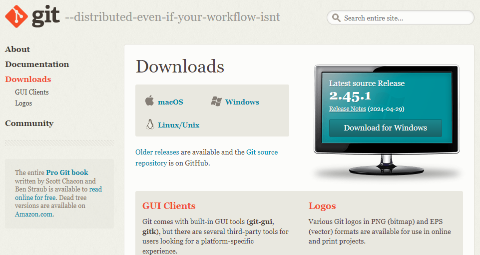
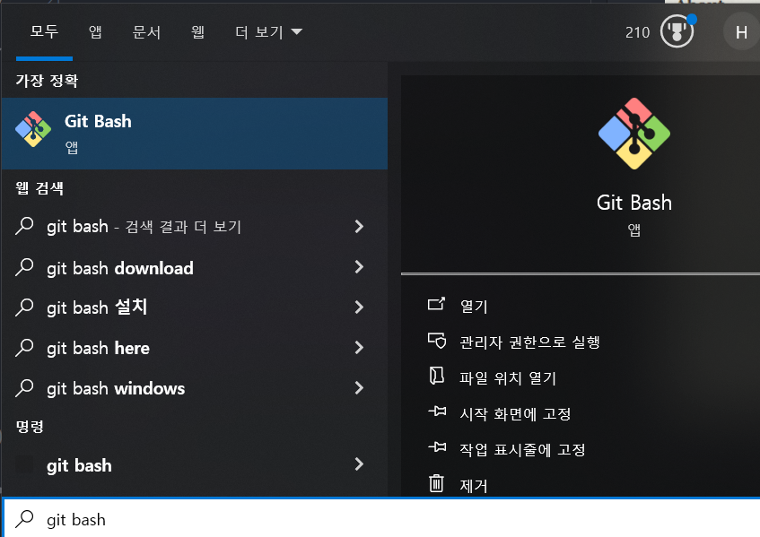
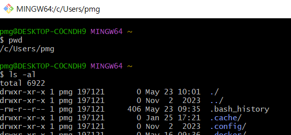
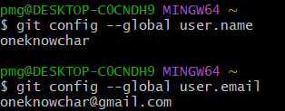
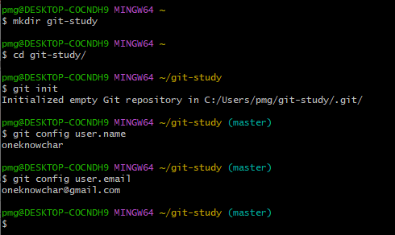
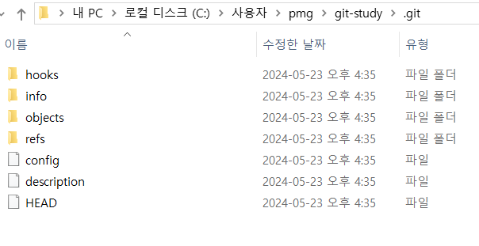
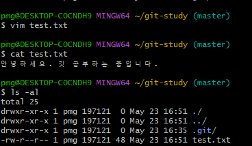
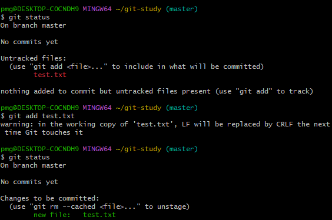

# Git  이란? 
하나의 온라인 저장소를 기준으로 여러 사람이 파일을 추가, 수정, 삭제하면서  
`버전관리`, `백업`, `협업`을 도와주는  프로그램입니다.  

깃을 다루는 프로그램의 종류로 GitHub Desktop, Tortoise, SourceTree, CLI(명령 프롬프트) 등이 있습니다.  
깃은 리눅스 명령어를 사용합니다.  
[깃을 설치](https://git-scm.com/downloads)하게 되면 Git bash라는 프로그램이 함께 설치되어 여기서 리눅스 명령어를 사용할 수 있습니다.  


# Git 세팅
## Git 설치  
[https://git-scm.com/downloads](https://git-scm.com/downloads)
<center>  

  
*사용자의 OS에 맞는 Git을 설치합니다.*  

  
*Git Bash 설치 완료*  

  

*windows OS 환경에서 Linux CLI를 사용할 수 있습니다.*  

</center>

# Git Command Line

## 사용자 정보 입력  
깃은 버전을 저장할 때마다 사용자 정보를 같이 저장합니다.  
누가, 어떤 버전을, 언제, 왜 만들었는지 파악할 수 있습니다.  따라서 Git은 `버전관리`, `백업`, `협업`에 많은 도움이 됩니다.

```
// $ 표시는 타이핑하지 않습니다.
// global옵션은 사용자 정보를 전역으로 설정합니다.

$ git config --global user.name {사용자 이름 또는 깃허브 아이디}  
$ git config --global user.email {사용자 이메일 또는 깃허브 이메일}
```  

  

*사용자의 이름과 이메일도 확인 할 수 있습니다.*


# 버전 관리
## git init  
깃을 사용해서 버전관리를 하려면, 깃을 위한 디렉토리를 설정해야합니다.  
이미 존재하는 폴더로 접근하던가, 새로운 폴더를 만들어 봅니다.  
```
$ mkdir git-study
$ cd git-study

$ git init
```
  

*(master)라는 문구가 생겼습니다.*  

  

*숨겨진 .git 폴더와 함께 자동으로 몇개의 파일들이 생성되었습니다.*  

## .git 이란?  
.git 는 내부에 stage와 repository를 저장하는 공간 입니다.  
깃에는 3가지의 영역 개념이 존재 합니다.  

1. 작업트리(working tree) : 파일 생성, 수정, 삭제 등 실제 업무가 일어나는 디렉토리  
2. 스테이지(stage) : 작업트리와 저장소 중간 영역으로 깃의 버전으로 만들 파일이 대기 하는 곳  
3. 저장소(repository) : 스테이지에서 대기하던 파일들을 버전을 만들고 저장하는 곳  


## git add && git status  


새로 만든 git-study 폴더에,  test.txt 파일을 만들고
test.txt 파일을 생성 후 "안녕하세요... " 문구를 추가했습니다.  


```
$ git status //깃 상태 조회 명령어
$ git add {파일명}  //수정한 파일을 스테이지에 추가
```
  

1. git status명령어로 .git 폴더와 git-study 폴더를 비교합니다.  
2. stage 영역에 없고, 한 번도 버전 관리하지 않은 `Untracked`파일인 test.txt 파일이 발견되었습니다.
3. git add test.txt 명령어로 test.txt 파일을 stage에 담았습니다.
4. git status 깃 상태 조회를 하니 `new file : test.txt` 정상적으로 새로운 작업물이 stage에 담겼습니다.
5. git add 시에 `warning` 문구는 다른 OS 간에 문자 개행시 발생하는 오류입니다. 어떠한 조치를 해야 하는 것은 아니니 무시하셔도 됩니다.


