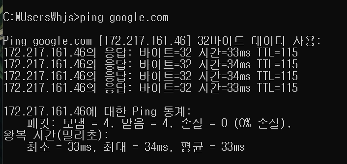

# ping 테스트

현재 진행중인 프로젝트에서
유저가 입력한 정보를 xml로 담아 파일로 만들고 전송하는 업무를 담당하고 있습니다.

첫 번째로 방화벽에 문제에 맞이하여 해지를 하며  
ping 테스트로 로컬에서 운영서버의 접근은 가능을 확인할 수 있었습니다.(개발, 테스트계는 실패)

```
ping 127.0.0.1  //포트 번호는 입력하지 않습니다
```



# encoding 문제

목적시 서버 url의 핑 테스트를 통해 정상 동작을 확인하고  
실제 전송 업무를 작업하였습니다.

xml 및 촬영 사진들을 body에 담아 전송하는데, 목적지 측에서 xml 파싱 에러를 리턴 받았습니다.  
결국 해당 담당자분과 연락하여 실제 전송된 xml을 확인 해 보니,
한글 인코딩 문제로 xml파일이 깨졌습니다.

로컬은 `UTF-8`로 문제가 없었으나,  
목적지는 `EUC-KR`로 받고 있었기에 문제.

## 첫 번째 시도

xml을 구성하는 문자열을 변환했었습니다.

```
...

StringBuffer sb = new StringBuffer();
sb.append("<xml>... </xml>");

String encodedXmlStr = new String (sb.toString().getBytes(), "EUC-KR");

ows.write(encodedXmlStr);
ows.flush();
```

실패 했습니다.

## 두 번째 시도(성공)

```
	public static void main(String[] args) {
		File dummyFile = new File("C:\\Users\\hjs\\test\\dummy.txt");
		String ln = "\n";

		try {
			FileOutputStream fos = new FileOutputStream(dummyFile, false);
			OutputStreamWriter osw = new OutputStreamWriter(fos, "EUC-KR");

			StringBuffer sb = new StringBuffer();

			sb.append("시작").append(ln);
			sb.append("EUC-KR 인코딩 작성1").append(ln);
			sb.append("EUC-KR 인코딩 작성2").append(ln);
			sb.append("EUC-KR 인코딩 작성3").append(ln);
			sb.append("끝").append(ln);

			osw.write(sb.toString());
			osw.close();
		} catch (Exception e) {
			e.printStackTrace();
		}
	}
```

## 차이점?

첫 번째 방법은 OutputStreamWriter를 사용해 직접 문자열을 지정한 인코딩(EUC-KR)으로 변환하여 파일에 저장하므로, 인코딩이 적용

두 번째 방법은 문자열을 먼저 시스템 기본 인코딩으로 바이트 배열로 변환한 후, 이 바이트 배열을 EUC-KR로 다시 변환하려고 시도합니다. 이로 인해 인코딩 불일치가 발생
