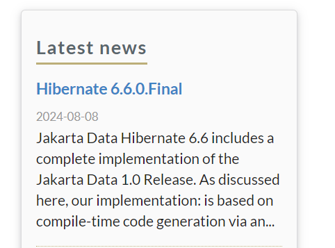
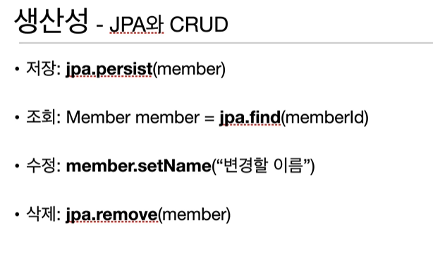
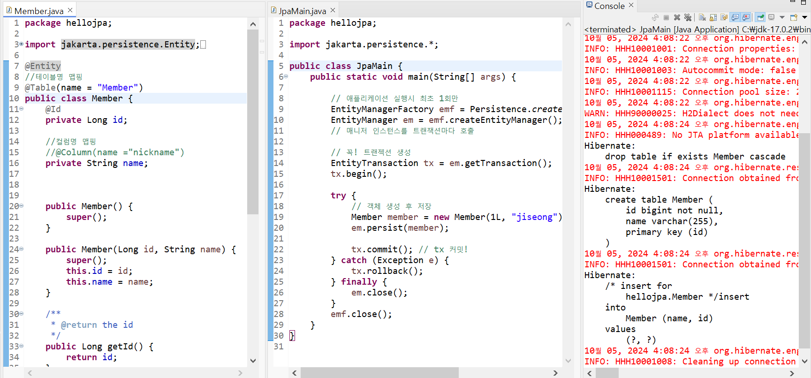
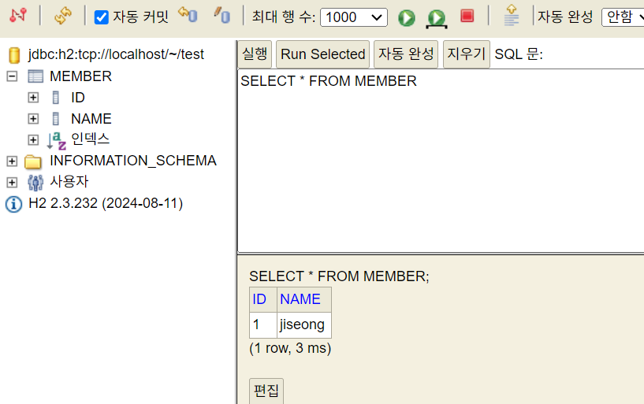

# JPA 공부 시작의 이유

_"쿼리 작성하는게 귀찮습니다."_

집에서 혼자 공부할때마다  
마이바티스를 사용하며 테이블을 생성하고, xml을 만들어 쿼리를 작성...

새로운 테이블 생성시 또 CURD 작성...

데이터를 얻는 그 과정이 너무 불편하고 시간이 지체됩니다.

이제는! 개발 그 자체에 집중하기로 마음먹었습니다.

---

# github Link

[https://github.com/oneknowchar/study-jpa](https://github.com/oneknowchar/study-jpa)

# JPA 사이트 및 최신 버전 확인

  
_글을 작성하는 현재 시각 2024-10-05 15:04_

# 기본적인 JPA CURD

## 최초 JPA 실행, 결과

[실제 작성한 코드 보기 Click! (github link)](https://github.com/oneknowchar/study-jpa/blob/main/ex1-hello-jpa-start/src/main/java/hellojpa/JpaMain.java)

---

여기까지 QueryDsl 세팅과 gradle build, 간단한 querydsql 실행까지 다뤄봤습니다.
