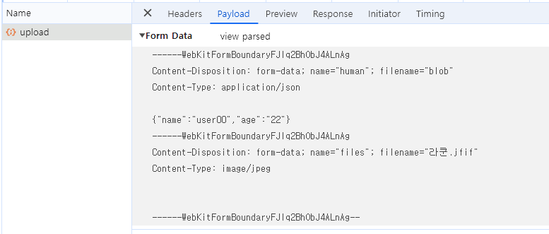

# json을 String으로 전송

```
//frontEnd
 formData.append("human", JSON.stringify(human));


//BackEnd
	@PostMapping(path = "/upload")
	@ResponseBody
	public ResponseEntity<ResponseDTO> test(
		@RequestPart("files") List<MultipartFile> files,
		@RequestPart("human") String humanStr)
	{
    //문자열로 받은 뒤 컨트롤러 내부에서 객체로 파싱
    ObjectMapper objectMapper = new ObjectMapper();
    Human human = objectMapper.readValue(humanStr, Human.class);

    이하 중략...
    }
```

# json을 Blob, application/json 전송

```
//frontEnd(핵심)
formData.append("human", new Blob([JSON.stringify(human)], { type: "application/json" }));

//BackEnd
	@PostMapping(path = "/upload")
	@ResponseBody
	public ResponseEntity<ResponseDTO> test(
	  @RequestPart("files") List<MultipartFile> files,
	  @RequestPart("human") Human humanObj) throws IllegalStateException, IOException
	  {

    이하 중략...
  }
```

# Blob으로 보내는 이유

> 파일과 JSON을 함께 전송할 때 각각의 Content-Type 명시 가능 여부

multipart/form-data는 요청 전체에 대한 Content-Type을 지정하는 것이지, 각각의 필드에 대해 별도의 Content-Type을 직접 지정할 수는 없습니다.

다만, JSON 데이터를 Blob으로 감싸면서 application/json 타입을 부여하는 것은 가능합니다.

파일의 경우, 브라우저가 자동으로 파일의 MIME 타입을 처리합니다.

## Blob으로 보내지 않는 경우

application/octet-stream not supported 예외가 발생합니다.  
파일과 json의 타입을 동시에 보내기 위해선
Content-Type을 **multipart/form-data** 여야 합니다.

### content-type 이 null인 이유

[Multipart 전송 시 Json 데이터 같이 보낼 경우 주의점](https://treecode.tistory.com/117)

# 파일의 content-type

만약 파일만 전송한다면 MIME 타입을 Content-Type으로 지정할 수 있습니다.

**_Content-Type: image/jpeg_**

파일과 함께 다른 데이터를 전송해야 한다면, **multipart/form-data**가 사용됩니다.

# JSON의 content-type

JSON 데이터만 전송할 때는 **Content-Type: application/json**을 설정합니다. 이 경우, 요청 본문은 순수한 JSON 형식의 데이터를 포함하며, 서버는 이를 파싱하여 처리합니다.

# @RequestBody

Spring에서는 @RequestBody 어노테이션을 사용하여 JSON 데이터를 Java 객체로 받을 수 있습니다.

Content-Type: application/json 요청이 들어오면, Spring은 자동으로 요청 본문을 Java 객체로 변환합니다.
대신 이 어노테이션은 파일을 처리할 순 없습니다!

# @RequestPart

Spring에서 파일 업로드와 JSON 데이터를 동시에 처리하는 방법은 **@RequestPart**를 사용하는 것입니다.

각각의 파트들의 선언한 name을 명시해 줘야 합니다!!

```
@RequestPart("files") List<MultipartFile> files,
@RequestPart("human") Human humanObj)
```

## 

_명시한 name으로 일치시킵니다._

---

여기까지 컨트롤러에서 멀티파트와 제이슨을 같이 받는법을 알아보았습니다.
