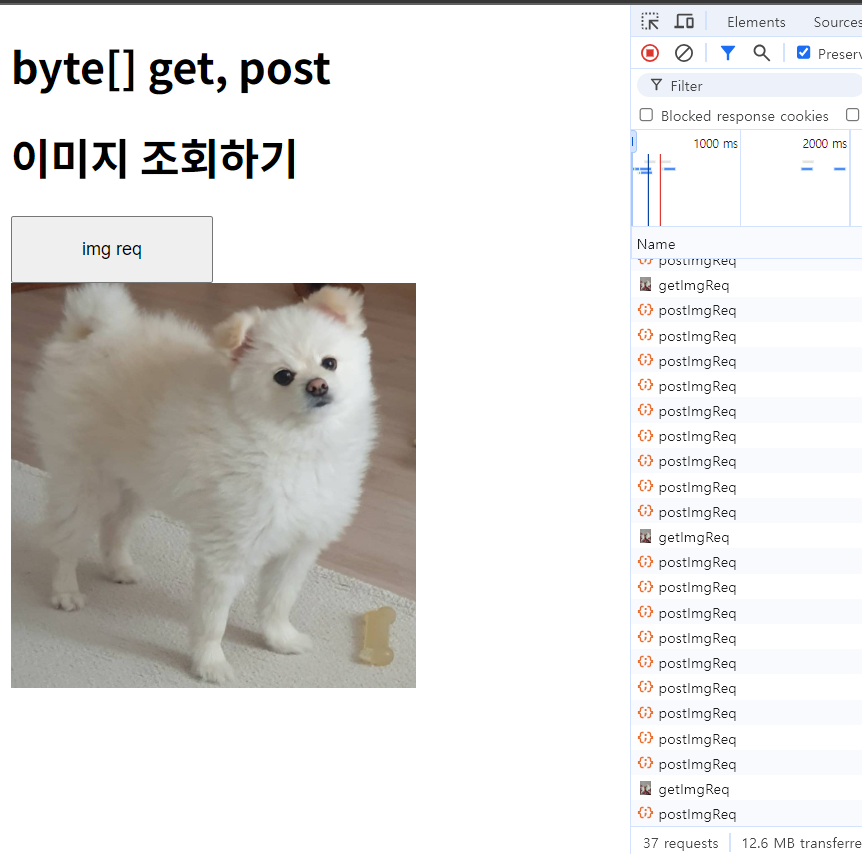
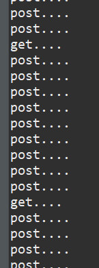

# 결과 화면



# 코드 공유

## controller

```
  @GetMapping("/getImgeIndex")
	public String getImgeIndex() {
		log.debug("getImgeIndex");
		return "getImgeIndex";
	}

	@GetMapping("/getImgReq")
	public ResponseEntity<byte[]>getImgReq() throws IOException{
		System.out.println("get....");
		String imgPath = "D:\\사진 동물\\rocky1.jpg";
		File imgFile = new File(imgPath);
		if(imgFile.exists()) {
			HttpHeaders headers = new HttpHeaders();

			headers.setContentType(MediaType.parseMediaType(Files.probeContentType(imgFile.toPath())));
			headers.setContentLength(Files.size(imgFile.toPath()));

			return  ResponseEntity.ok().headers(headers).body(Files.readAllBytes(imgFile.toPath()));

		}else {
			return ResponseEntity.badRequest().build();
		}
	}

	@PostMapping("/postImgReq")
	@ResponseBody
	public ResponseEntity<FileDTO> postImgReq() throws IOException{
		System.out.println("post....");
		String imgPath = "D:\\사진 동물\\rock2.jpg";
		File imgFile = new File(imgPath);

		if(imgFile.exists()) {
			//pure byte[]
			byte[] fileData = Files.readAllBytes(imgFile.toPath());

			//base64 encode
			String base64Data = Base64.getEncoder().encodeToString(fileData);

			return ResponseEntity.ok().body(new FileDTO(fileData, base64Data));
		}else {
			return ResponseEntity.notFound().build();
		}
	}
```

## html

```
<!DOCTYPE html>
<html lang="en">
<head>
  <meta charset="UTF-8">
  <meta name="viewport" content="width=device-width, initial-scale=1.0">
  <title>Document</title>
  <!--<script src="/jquery.js"></script> -->
  <script src="https://code.jquery.com/jquery-latest.min.js"></script>

</head>

<body>
  <div>
  <h1>byte[] -> base64 encode, </h1>
  <h1>이미지 조회하기</h1>
  <div>
  	<button id="btn" style="width: 150px; height: 50px;">post img req</button>
  </div>

  
  </div>
  <script>
  let flag = false;
	$(document).ready(function () {
		$('#btn').on('click', function(){
			flag = !flag;
			if(flag){
				$.ajax({
					type: 'post',
			          url: '/fileController/postImgReq',
			          contentType: false,
			          processData: false,
			          success: function (res) {

			        	  if(res.fileData === res.base64Data){
				              const imgUrl = "data:image/png;base64," + res.fileData;

				              $('#imgId').attr('src', imgUrl);  // 이미지를 화면에 표시
			        	  }else{
			        		  alert('ERROR!!!');
			        	  }
			          },
			          error: function (error) {
			            console.log(error);
			          }
				});
			}else{
				$('#imgId').attr('src', '/fileController/getImgReq');
			}
		});

	});
  </script>
</body>
</html>

```

# 파일 요청시 get, post의 차이?

해당 화면의 브라우저의 총 37번의 연속된 요청에서  
이미지 요청 버튼을 여러번 클릭하여 get과 post로 이미지를 호출했습니다.

get방식의 이미지는 5번 요청 되었습니다.  
post 방식의 이미지는 17번 요청 되었습니다.

서버 로그를 확인해 보니  
get 과 post controller를 번갈아 호출할 줄 알았지만 post 요청이 압도적으로 많습니다.

## 

브라우저가 캐싱을 하기 때문입니다.

---

여기까지 컨트롤러에서 이미지 파일을 호출, 브라우저에서 이미지 조회를 알아보았습니다.
