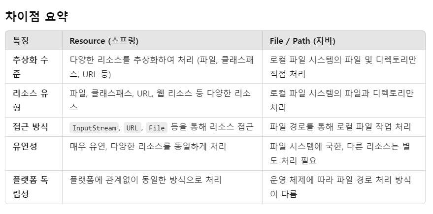

# 추상화 수준 및 목적

## Resource (스프링)

파일 시스템, 클래스패스, URL 등 다양한 리소스 소스를 추상화합니다.  
파일 외에도 여러 소스에서 리소스를 로드할 수 있는 범용적인 인터페이스입니다.  
스프링에서 존재하는 인터페이스 입니다.

파일 시스템의 파일, 클래스패스의 리소스, 웹 URL 등 다양한 형태의 리소스를 다룰 수 있습니다.

다양한 리소스 형태를 지원하기 때문에 매우 유연합니다.  
동일한 코드를 사용해 파일, URL, 클래스패스의 리소스를 처리할 수 있습니다.  
예를 들어, 클래스패스에서 파일을 읽을 때도 동일한 메서드를 사용합니다.

주로 리소스의 읽기 작업을 위한 추상화입니다.  
파일을 생성하거나 수정하는 작업은 지원하지 않습니다.

## File/Path (자바)

로컬 파일 시스템에서 파일과 디렉토리를 직접 다루는 자바 API입니다.  
파일 경로, 파일 속성, 파일 작업을 지원하지만 로컬 파일 시스템에 국한됩니다.  
자바에 존재하는 클래스이므로 스프링에 국한되지 않습니다.

로컬 파일 시스템에 있는 파일과 디렉토리만 다룹니다.  
외부의 리소스나 클래스패스의 리소스는 직접적으로 처리할 수 없습니다.

# 주요 메서드 및 기능

## Resource

스프링이 제공하는 여러 구현체(FileSystemResource, ClassPathResource, UrlResource 등)로 다양한 리소스에 접근할 수 있습니다.
주요 메서드로는 getInputStream() (리소스 읽기), getURL() (리소스의 URL 반환), exists() (리소스 존재 여부 확인) 등이 있습니다.

```
Resource resource = new ClassPathResource("data.txt");
InputStream inputStream = resource.getInputStream();
```

## File/Path

파일 경로와 파일 작업에 특화된 메서드가 있습니다. exists(), createFile(), readAllBytes(), delete() 등의 메서드로 파일 시스템 작업을 수행합니다.

```
Path path = Paths.get("/path/to/file.txt");
boolean existsPath = Files.exists(path);
```

## 차이점

### 1. 플랫폼 독립성

Resource: 플랫폼에 독립적입니다.
파일 시스템뿐만 아니라 웹 리소스, 클래스패스 리소스도 동일한 방식으로 접근할 수 있어 환경에 구애받지 않고 동작합니다.

File/Path: 주로 로컬 파일 시스템에 의존하며, 운영 체제에 따라 파일 경로 형식이 달라질 수 있습니다.
파일 경로의 구문(예: 윈도우의 \와 유닉스 기반 시스템의 /)에서 차이가 발생할 수 있습니다.

### 2. 사용 사례

Resource: 스프링 애플리케이션에서 파일뿐만 아니라 다양한 리소스를 유연하게 처리하고자 할 때 사용합니다.
주로 의존성 주입, 외부 설정 파일 로드, 정적 리소스 관리 등에서 사용됩니다.

File/Path: 파일 시스템 작업에 최적화된 API로, 파일 생성, 삭제, 읽기, 쓰기 등의 파일 작업을 처리할 때 사용됩니다.



# 그렇다면 Resource로 완전 대체 가능한지?

스프링의 Resource 인터페이스는 다양한 리소스(파일, 클래스패스 리소스, URL 리소스 등)를 추상화하여 일관된 방식으로 접근할 수 있게 합니다.
파일 시스템 내의 파일을 다루는 경우에도 **FileSystemResource**를 사용하여 파일을 처리할 수 있습니다.

```
Resource resource = new FileSystemResource("/path/to/file.txt");
InputStream inputStream = resource.getInputStream();
```

스프링에서 파일 시스템의 파일에 접근할 때도 Resource로 통일하여 처리할 수 있습니다.
이를 통해 파일뿐만 아니라 다른 리소스 타입도 동일한 방식으로 다룰 수 있다는 장점이 있습니다.

하지만, 자바의 File 또는 **Path**가 필요한 경우도 있습니다.

파일 시스템에서 파일 생성, 삭제, 이동, 복사 등의 작업을 할 때는

File이나 Path 자바의 파일 시스템 API가 더 적합합니다.

파일의 메타데이터(권한, 속성 등)를 다루거나, 파일의 특정 부분만 읽거나 쓰는 경우에도 자바의 File이나 Path가 필요합니다.

```
Path path = Paths.get("/path/to/file.txt");
Files.createFile(path); // 파일 생성
```

# File, Files & Path 차이점

## File (자바 1.0)

자바 1.0 초기부터 존재하던 클래스로, 파일과 디렉토리 작업을 위한 기본적인 기능을 제공했습니다.  
하지만 File 클래스는 다양한 단점이 있습니다.

I/O 작업에서 예외 처리가 제한적입니다.  
메서드들이 주로 boolean 값을 반환해서 에러 원인을 파악하기 어려웠습니다.

파일 시스템에 종속적이며, 심볼릭 링크 등의 고급 기능을 제대로 처리하지 못했습니다.

파일과 디렉토리를 모두 동일한 클래스로 처리하여 API 설계가 모호합니다.

파일 속성을 처리할 수 있는 기능이 제한적입니다. 예를 들어, 파일의 크기나 수정 날짜를 얻을 수는 있지만, 다른 세부 속성(예: 파일 권한)은 다루기 어렵습니다.

많은 메서드들이 boolean 값을 반환해 성공 여부만 알려주고, 실패 원인에 대한 세부 정보가 부족합니다.

## Files & Path (자바 7.0)

자바 7부터 도입된 NIO.2 API는 기존의 File 클래스를 대체하고, 더 많은 기능을 제공하는 Path 인터페이스와 Files 유틸리티 클래스를 제공합니다.

Path: 파일이나 디렉토리의 **경로를 나타내는 객체**입니다. File과 달리 Path는 운영체제에 독립적인 추상화된 경로를 제공하며, 훨씬 유연하고 다양한 경로 처리를 지원합니다.

Files: 파일 관련 작업(생성, 삭제, 읽기, 쓰기, 복사, 이동 등)을 지원하는 **유틸리티 클래스**로, 기존의 File 클래스에서 부족했던 부분을 많이 보완합니다.

파일의 권한, 소유자, 시간 속성 등 다양한 메타데이터를 다룰 수 있는 기능을 제공합니다.

대부분의 메서드가 명시적으로 예외를 던지므로, 오류 원인을 명확히 파악할 수 있습니다.

### Files & Path 로 완전 대체 가능

자바의 Files와 Path로, File 클래스는 완전 대체가능합니다.
모든 File 기능을 대체합니다.
추가로 권한, 메타데이터 접근 등 더 많은 기능을 제공합니다.
운영 체제에 독립적인 경로처리, 향상된 예외처리 및 성능과 추가 기능들 사용을 위해
File, Path를 사용하는것이 권장됩니다.

# 정리

읽기 작업은 Resource로 통일해서 처리하는 것이 가능하며, 매우 유용합니다.

그러나, 파일 생성, 수정, 삭제와 같은 파일 시스템 작업을 처리할 때는 여전히 자바의 **File/Path**를 사용하는 것이 더 적합합니다.

스프링의 **Resource**와 자바의 **File/Path**를 함께 병행하여 사용하면, 파일 시스템 작업을 원활하게 처리할 수 있습니다.

따라서, 스프링 프레임워크를 사용할 때 **리소스 처리(읽기)**는 **Resource**로 통일할 수 있지만, 파일 시스템 작업이 필요할 때는 File 또는 **Path**가 필요할 수 있습니다.

---

여기까지 스프링의 Resource, 자바의 File과 Path에 대해 알아보았습니다.
