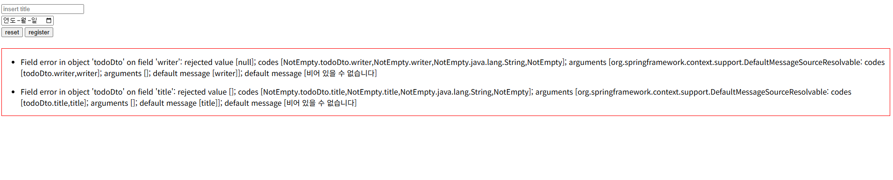
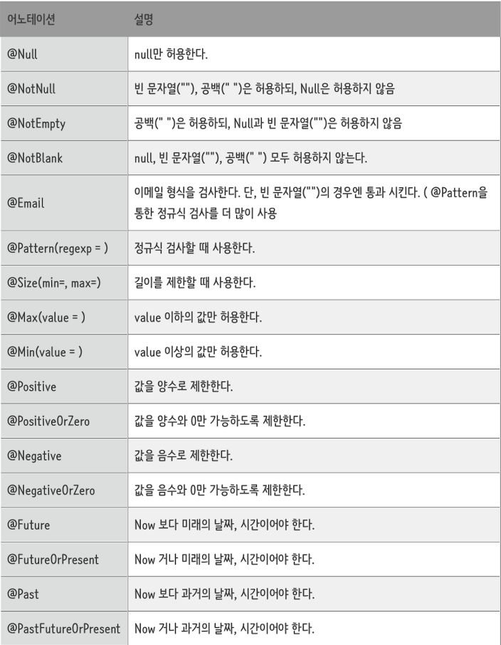

# 스프링에서 validation 사용하기  
서버에서 사용자의 입력값을 처리할 때 화면이 있는 경우 클라이언트에서 유효성 검사를 진행합니다.  
하지만 API로만 진행을하게 되는 경우, 사용자 화면이 따로 없어 자바스크립트로 유효성 검사가 불가능한 경우엔  
서버에서도 유효성 검사를 할 수 있어야 하며  
스프링에선 이미 편하게 사용할 수 있도록 구현되어 있습니다.  

## build.gradle, validation 라이브러리 추가  

```java  
  implementation 'org.springframework.boot:spring-boot-starter-validation'
```  

## DTO에 벨리데이션 어노테이션 추가    

```java   
@Getter
@Setter
@ToString
@NoArgsConstructor
@AllArgsConstructor
@Builder
public class TodoDto {
	private Long tno;

	@NotEmpty //valid 어노테이션 
	private String title;

	@Future //valid 어노테이션
	@DateTimeFormat(pattern = "yyyy-MM-dd'T'HH:mm")
	private LocalDate dueDate;
	@DateTimeFormat(pattern = "yyyy-MM-dd'T'HH:mm")
	private LocalDateTime finished;

	@NotEmpty //valid 어노테이션
	private String writer;
}
```  

## 컨트롤러 매개변수, 로직 추가  

```java 
	@PostMapping("/register")
	public String registerPost(@Valid TodoDto todoDto, BindingResult bindingResult, RedirectAttributes redirectAttributes) {
		log.info("POST todo Register");
		
		if(bindingResult.hasErrors()) {
			log.info("has errors.......");
			redirectAttributes.addFlashAttribute("errors", bindingResult.getAllErrors());
			return "redirect:/todo/register";
		}
		
		//저장 로직
//		try {
//			todoService.register(todoDto);
//		} catch (Exception e) {
//			e.printStackTrace();
//		}
		return "redirect:/todo/index";
	}
```

## 뷰탬플릿 redirectAttributes.addFlashAttribute 사용    

```html
		<div th:if="${errors}" style="border:1px solid red">
			<ul th:each="error : ${errors}">
				<li th:text="${error}" >errorzz</li>
			</ul>
		</div>
```  

또는 스크립트에 데이터를 담아서 처리할 수 도 있습니다.


## 결과  



## 그 외 다른 어노테이션 종류들(구글 펌)


---

여기까지 스프링의 validation에 대해 알아보았습니다.
