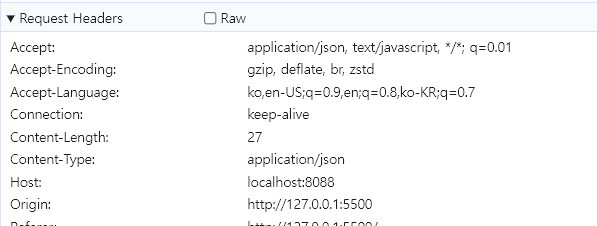
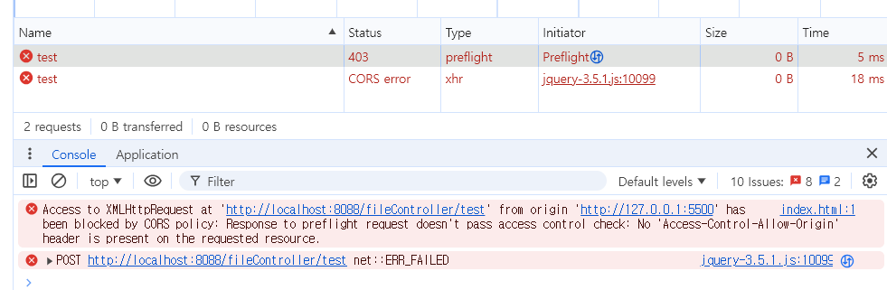
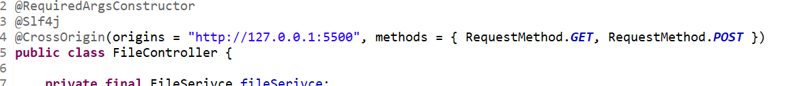
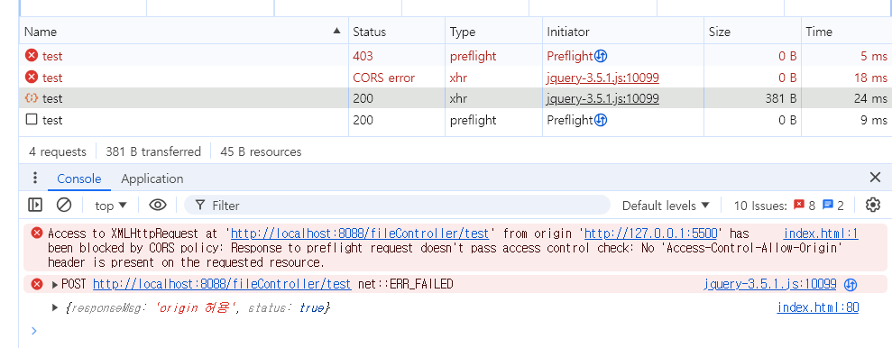
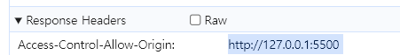

# CORS 란?

Cross-Origin Resource Sharing (CORS)  
[https://developer.mozilla.org/ko/docs/Web/HTTP/CORS](https://developer.mozilla.org/ko/docs/Web/HTTP/CORS)

클라이언트와 서버간의 서로 다른 출처(도메인) 허용 여부 검사
만약 허용되지 않는 출처인 경우
클라이언트와 서버가 서로 다를 때(도메인) 서버가 이를 허용해 줘야합니다.

  
_로컬 서버에 요청합니다._  
클라이언트의 오리진은 http://127.0.0.1:5500으로  
요청하는 서버의 localhost:8088과는 다르다는걸 알 수 있습니다.

  
_에러 발생 !!! CORS ERROR CASE_

스프링 서버에서 아래와 같이 클라이언트의 출처(도메인)을 허용합니다.
  
_클라이언트 오리진 허용_

<p id="focusHere"></p>

  
_요청에 대한 응답 정상 response_

  
_해당 요청의 응답부분을 보면, 허용됐음을 확인할 수 있습니다._

# preFlight

유저가 서버 요청시 브라우저는 `preFlight request`를 전송합니다.

서버는 유저 도메인의 요청을 허용하는지 검사한 뒤  
브라우저는 `actual request`를 전송합니다.

CORS 규정에 의해 실제 요청(actual request)은 preFlight 이후 전송 됩니다.

# CORS 장점

CORS를 통해 웹 애플리션의 보안을 높일 수 있습니다.  
사이트간 위조(CSRF)와 같은 보안 취약점을 줄이는데 도움이 됩니다.

# CORS 단점

매 요청마다 2번의 요청이 진행됩니다.(pre flight, actual request)  
<a href="#focusHere">사진 보기</a>

네트워크 레이턴시 증가, 추가적인 네트워크 트래픽 발생이됩니다.

# CORS 단점 해결 cache

서버 마다, CORS 설정을 통해 preFlight 요청을 캐싱할 수 있습니다.  
브라우저는 캐시된 응답을 사용하여 서버에 대한 실제 요청을 보내기 전에 CORS 정책을 검증합니다.  
이로 인해 네트워크 요청이 줄어들고 성능이 개선됩니다.

```
// server side
// Cache preflight response for 3600 seconds (1 hour)
configuration.setMaxAge(3600L);
```

---

여기까지 CORS에 대해서 다뤄봤습니다.
